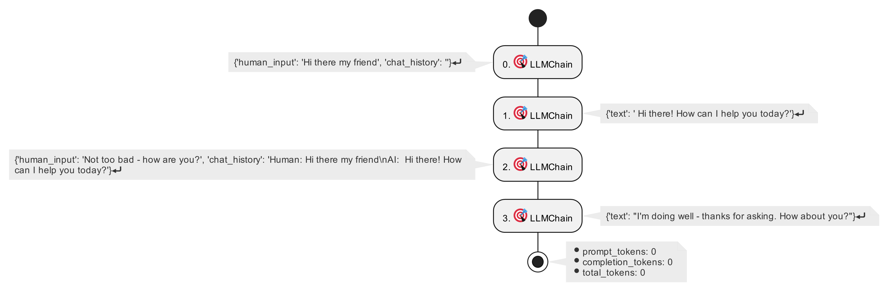

# LangChain PlantUML Callback Handler

[](https://opensource.org/licenses/Apache-2.0)
[](https://pypi.org/project/langchain-plantuml/)
[](https://github.com/coolbeevip/langchain_plantuml/actions/workflows/lint.yml)
[](https://github.com/coolbeevip/langchain_plantuml/actions)
[](https://github.com/psf/black)
[](https://pypi.org/project/langchain-plantuml/)

Subscribe to events using a callback and store them in PlantUML format. You can easily subscribe to events and keep them in a form that is easy to visualize and analyze.


## Quick Start

Install this library:

```shell
pip install langchain-plantuml
```

Then:

1. Add import langchain_plantuml as the first import in your Python entrypoint file
2. Create a callback using the activity_diagram_callback function
3. Hook into your LLM application
4. Call the export_uml_content method of activity_diagram_callback to export the PlantUML content
5. Save PlantUML content to a file
6. Exporting PlantUML to PNG

Running the minimal example.

```python
from langchain import OpenAI, LLMChain, PromptTemplate
from langchain.memory import ConversationBufferMemory

from langchain_plantuml import diagram

template = """You are a chatbot having a conversation with a human.

{chat_history}
Human: {human_input}
Chatbot:"""

prompt = PromptTemplate(
    input_variables=["chat_history", "human_input"], template=template
)
memory = ConversationBufferMemory(memory_key="chat_history")

callback_handler = diagram.activity_diagram_callback()

llm_chain = LLMChain(
    llm=OpenAI(),
    prompt=prompt,
    verbose=True,
    memory=memory,
    callbacks=[callback_handler]
)

llm_chain.predict(human_input="Hi there my friend")
llm_chain.predict(human_input="Not too bad - how are you?")

plantuml_content = callback_handler.export_uml_content()
with open("example.puml", "w") as f:
    for line in plantuml_content:
        f.write(str(line) + "\n")
```

You will get the following PlantUML activity diagram



## Exporting PlantUML to PNG

You can download [plantuml.1.2023.10.jar](https://github.com/plantuml/plantuml/releases/download/v1.2023.10/plantuml-1.2023.10.jar)

```shell
java -DPLANTUML_LIMIT_SIZE=81920 -jar plantuml-1.2023.10.jar example.puml
```

